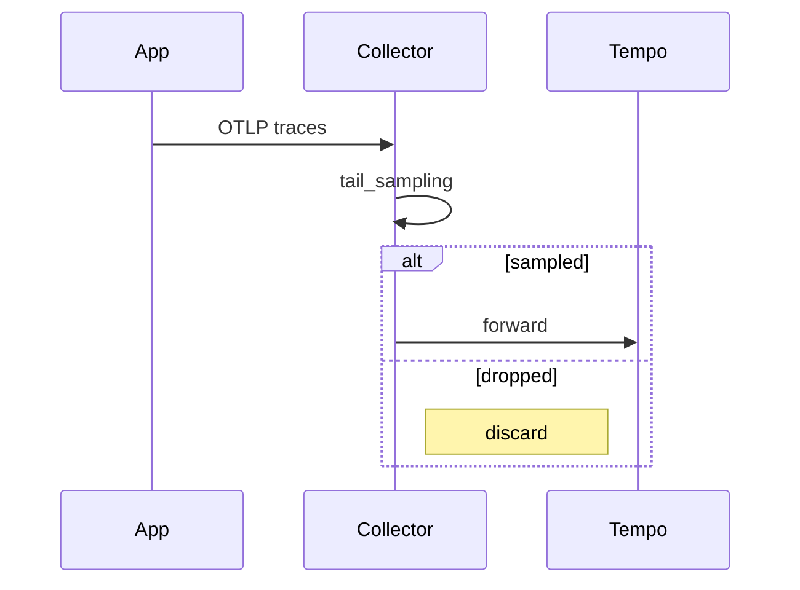
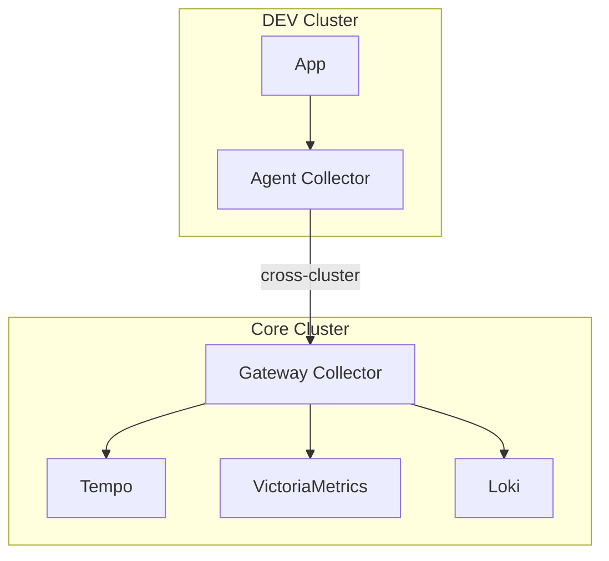
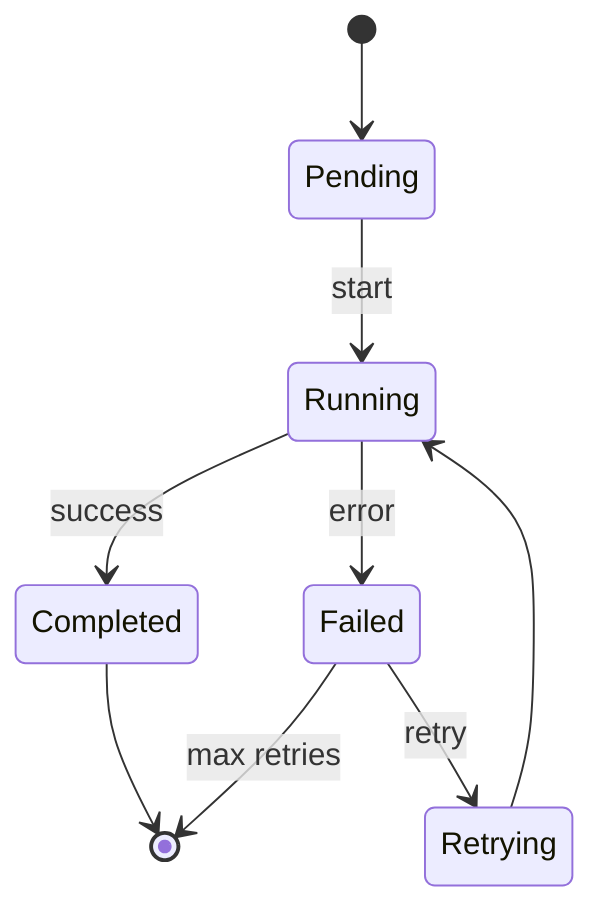
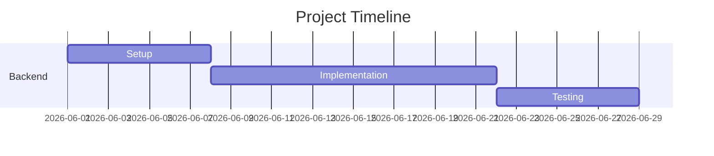
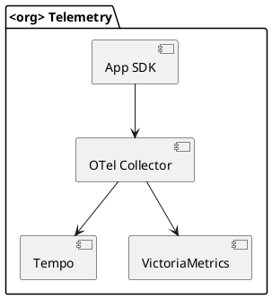

# Diagram Patterns

Decision framework for technical diagrams in <org> documentation.

## When to Use

- Choosing diagram tool for a specific documentation context
- Drawing architecture, sequence, flow, or state diagrams
- Adding diagrams to MkDocs, README, or PR descriptions

## When NOT to Use

- Diagrams for slides/presentations → use drawio or Figma directly
- UML class diagrams for code documentation → generate from code instead
- Data flow for marketing materials → graphic design team

## Mermaid Examples (copy-paste ready)

See `references/mermaid-examples.md` for 8 production-ready patterns:
- Flowchart, Sequence, Architecture, State, Pipeline, ER, Gantt, GitOps flow

## Decision matrix

| Type | Strengths | Weaknesses | Use for |
|------|-----------|------------|---------|
| **ASCII art** | Plain text, version-controllable, terminal-friendly | Limited shapes, rough visuals | Pipelines, simple flows, READMEs |
| **Mermaid** | Text-based, rendered by GitHub/GitLab/MkDocs, easy to edit | Limited customization, can be ugly | Architecture, sequences, flowcharts |
| **drawio (PNG/SVG)** | Highly polished, full control, presentations | Binary diff, harder to edit, requires tool | External docs, slides, formal architecture |
| **PlantUML** | Powerful, supports many diagram types | Requires server/plugin to render | Sequence diagrams, deployments |

## Decision rules

1. **In code repos** → ASCII or Mermaid (text, version-controllable)
2. **In MkDocs sites** → Mermaid (auto-rendered)
3. **In GitHub/GitLab READMEs** → Mermaid (native support)
4. **In presentations/external docs** → drawio (export PNG/SVG)
5. **In quick chat explanations** → ASCII

## ASCII art patterns

### Pipeline / flow

```
[Source]
    ↓ HTTP
[Processor]
    ↓ gRPC
[Backend]
    ↓
[Storage]
```

Use Unicode arrows: `↓` `→` `←` `↑` `↔`

### Multi-branch flow

```
       [Input]
          ↓
   ┌──────┴──────┐
   ↓             ↓
[Path A]    [Path B]
   ↓             ↓
   └──────┬──────┘
          ↓
       [Output]
```

### Box with label

```
┌─────────────────────────┐
│ Component Name          │
│ • Feature 1             │
│ • Feature 2             │
└─────────────────────────┘
```

Use Unicode box drawing: `┌` `┐` `└` `┘` `─` `│` `┬` `┴` `├` `┤` `┼`

### Multi-tier architecture

```
┌──────────────────────────────────────────┐
│ Layer 1: Ingestion                       │
│ ├── Component A                          │
│ └── Component B                          │
└─────────────────┬────────────────────────┘
                  ↓
┌──────────────────────────────────────────┐
│ Layer 2: Processing                      │
│ └── Component C                          │
└─────────────────┬────────────────────────┘
                  ↓
┌──────────────────────────────────────────┐
│ Layer 3: Storage                         │
└──────────────────────────────────────────┘
```

## Mermaid patterns

### Flowchart

````markdown
```mermaid
graph LR
  A[App SDK] -->|OTLP gRPC| B[Collector]
  B --> C{Sampling}
  C -->|errors| D[Tempo]
  C -->|sampled| D
  C -->|dropped| E[/dev/null]
```
````

### Sequence diagram

````markdown

````

### Architecture (with subgraphs)

````markdown

````

### State diagram

````markdown

````

### Gantt (timeline)

````markdown

````

## drawio patterns

### When to use

- External-facing documentation
- Slide decks
- Polished architecture diagrams
- When stakeholders need to "approve" a diagram

### Workflow

1. Create diagram in https://app.diagrams.net or https://drawio.app
2. Export as PNG or SVG
3. Save source `.drawio` file in repo for future edits
4. Reference image in markdown:
   ```markdown
   
   ```

### File organization

```
docs/
├── images/
│   ├── architecture.svg
│   └── architecture.drawio    # Source
```

Always commit BOTH the rendered image AND the source. Future you (or someone else) needs the source to edit.

### Standard shapes for tech diagrams

- Rectangles: services, components
- Cylinders: databases
- Cloud: cloud services
- Hexagons: external systems
- Diamonds: decision points
- Dashed boxes: logical groupings

### Color conventions (<org> suggested)

- **Blue**: applications / services
- **Orange**: data flow / pipelines
- **Green**: storage / databases
- **Red**: alerts / errors / critical paths
- **Gray**: external systems
- **Yellow**: in-progress / planned

## PlantUML patterns

### Component diagram



PlantUML requires server-side rendering — usually skipped in favor of Mermaid for simplicity.

## Common pitfalls

### Pitfall: too much detail in one diagram
Solution: split into multiple diagrams (overview → details). Each diagram should answer ONE question.

### Pitfall: mixing notation styles
Solution: pick a style (UML, C4, ad-hoc) and stick to it within one project.

### Pitfall: ASCII art that breaks on small screens
Long ASCII art wraps poorly on mobile. Use Mermaid for diagrams >80 chars wide.

### Pitfall: drawio sources lost
Always commit `.drawio` source alongside the exported image.

### Pitfall: outdated diagrams in docs
When architecture changes, update the diagram in the same change — don't let diagrams drift from the system they describe.

## C4 model recommendation

For software architecture, follow C4 model levels:

1. **Context** (high-level): show your system + external actors
2. **Container**: services, databases, external systems
3. **Component**: inside a container, show key components
4. **Code** (rare): class diagrams (UML)

Most <org> docs need only Context + Container levels.

## Examples in <org> docs

### Common patterns seen in practice

- Telemetry/data-flow architecture in a service `README.md` — ASCII (renders everywhere, no tooling needed)
- Sample-app or client-library data flow in a `README.md` — ASCII
- Controller/system architecture in a platform repo `README.md` — ASCII
- drawio sources for external-facing docs — inventory and link them here as they're produced (see "drawio patterns" above)

## Tools

| Need | Tool |
|------|------|
| Quick text diagram | ASCII |
| In MkDocs/GitHub | Mermaid |
| Polished, presentation | https://app.diagrams.net (drawio) |
| Sequence diagrams | Mermaid (preferred) or PlantUML |
| AWS architecture | https://app.diagrams.net with AWS shape library |

## Reference

- Mermaid: https://mermaid.js.org/
- drawio: https://www.diagrams.net/
- C4 model: https://c4model.com/
- Box-drawing characters: https://en.wikipedia.org/wiki/Box-drawing_characters
- Related: `markdown-docs`, `mkdocs-conventions`

## Related skills
- `markdown-docs` — text documentation to accompany diagrams
- `mkdocs-conventions` — embedding diagrams in doc sites
- `api-docs-patterns` — documenting API flows visually
