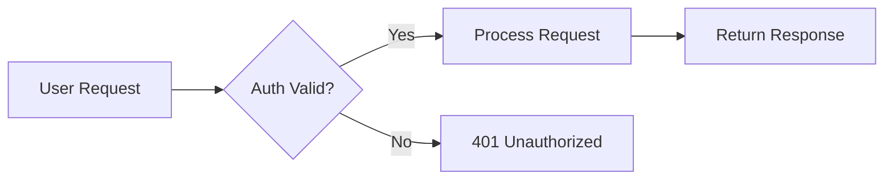
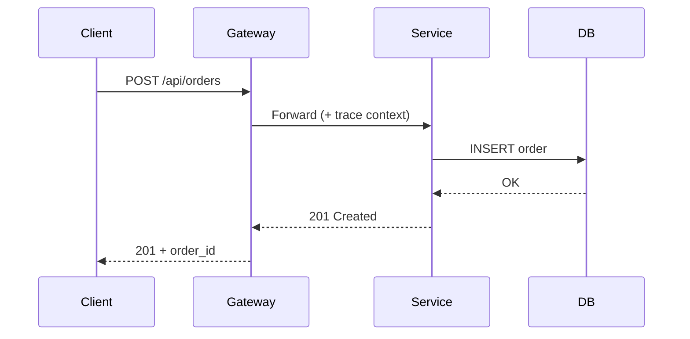
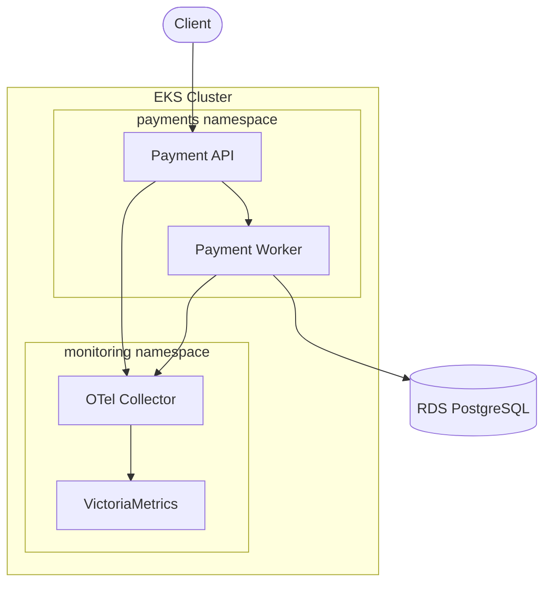
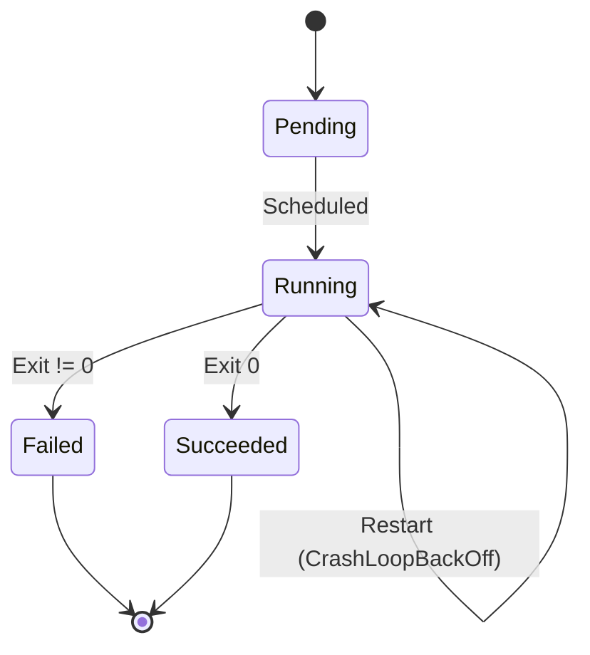
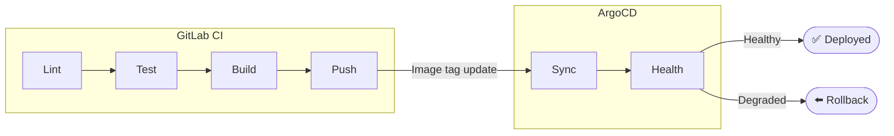
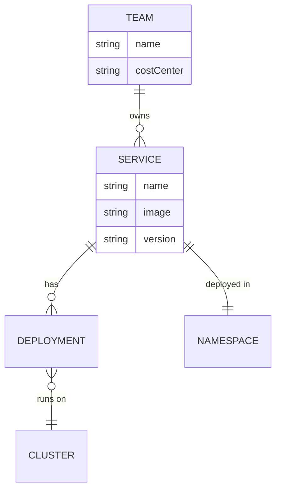
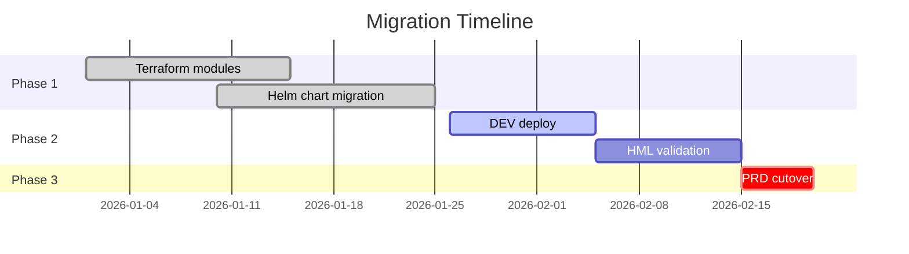
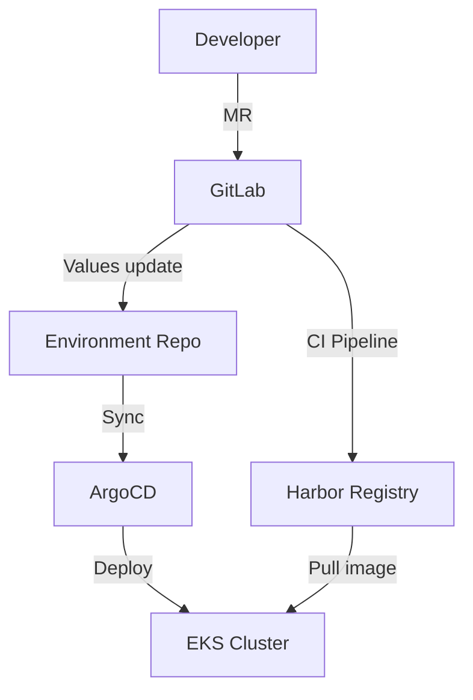

# Mermaid Diagram Examples

Copy-paste ready. Wrap in triple-backtick `mermaid` fences in Markdown.

---

## Flowchart (most common)

## Sequence Diagram (API calls, request flows)

## Architecture (C4-ish containers)

## State Diagram (lifecycle)

## Deployment Pipeline

## Entity Relationship (data models)

## Gantt Chart (project timelines)

## GitOps Flow (common at BDC)

---

## Tips

| Tip | Example |
|-----|---------|
| Direction | `LR` (left-right), `TB` (top-bottom), `TD` (top-down) |
| Shapes | `[rect]`, `(round)`, `{diamond}`, `([stadium])`, `[(cylinder)]` |
| Links | `-->` solid, `-.->` dotted, `==>` thick |
| Labels | `-->|label text|` |
| Subgraphs | Group related nodes visually |
| Styling | `style NodeID fill:#f9f,stroke:#333` |
