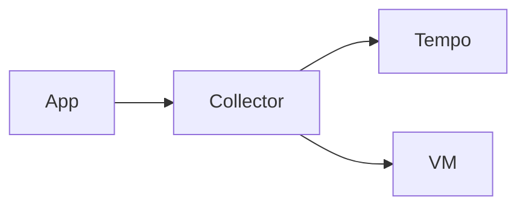

# Markdown Documentation Patterns

General-purpose Markdown style guide for <org>.

## When to Use

Markdown documentation patterns and conventions. Use when writing or reviewing README, technical docs, or any Markdown content. Covers structure, headings, tables, code blocks, links, callouts, common pitfalls.

## Document structure

### Standard sections (in order)

1. **Title (H1)** — only ONE H1 per document
2. **Brief intro paragraph** — what is this, who is it for
3. **Table of contents** (only for long docs >300 lines)
4. **Sections (H2)** — logical chunks
5. **Subsections (H3, H4)** — detail within sections

### Hierarchy rules
- Don't skip levels (H2 → H4 without H3)
- Max 4 levels deep (H1, H2, H3, H4) — beyond that, restructure
- Use sentence case for headings (`# Configuration options`, not `# Configuration Options`)

## Code blocks

### Always specify language
```markdown
```yaml
key: value
```

```bash
kubectl get pods
```

```python
def hello():
    pass
```
```

### Avoid
- ` ``` ` without language hint (no syntax highlighting)
- `code` for code longer than 1 line (use blocks)
- Code in tables (use blocks below the table instead)

### Path/file mentions
Use backticks for file paths and identifiers:
- `kubectl get pods` (command)
- `~/.kiro/agents/staffops.json` (path)
- `OtelHelper` (project name)
- `service.name` (attribute name)

## Tables

### Use tables for structured data
```markdown
| Column 1 | Column 2 |
|----------|----------|
| Value 1  | Value 2  |
```

### Don't use tables for
- Long prose (use paragraphs)
- Code (use code blocks)
- Mixed media (use lists with sub-items)

### Alignment
| Left | Center | Right |
|:-----|:------:|------:|
| `:---` | `:---:` | `---:` |

## Lists

### Bullet vs numbered
- Bullets (`-`): for unordered items where order doesn't matter
- Numbered (`1.`): for sequences, steps, ordered priorities

### Nested lists
- Use 2-space indent for nested items
- Don't go deeper than 3 levels (signal of bad structure)

## Links

### Internal repo links
Use relative paths:
```markdown
See [TODO.md](TODO.md) for status.
See [steering rules](steering/dev-environment.md).
```

### External links
- Use descriptive text: `[OTel Collector docs](https://opentelemetry.io/docs/collector/)`
- NOT: `[click here](...)` or `[https://...](https://...)`

### Anchor links
```markdown
See [Configuration](#configuration) below.
```
Heading "Configuration" → anchor `#configuration` (lowercase, spaces → hyphens).

## Callouts / Admonitions

GitHub-style:
```markdown
> [!NOTE]
> Useful information.

> [!WARNING]
> Caution required.

> [!IMPORTANT]
> Critical info.
```

For non-GitHub renderers, use bold:
```markdown
**Note**: useful information.

**Warning**: caution required.
```

## Diagrams

### When to use what

| Type | Use for | Example |
|------|---------|---------|
| ASCII art | Simple flow, terminal-friendly | Pipeline diagrams |
| Mermaid | Complex flows, sequence diagrams | Architecture, sequence |
| drawio (PNG/SVG) | Highly polished, presentations | External docs, slides |

See related: `diagram-patterns` skill.

### ASCII example
```
[App SDK]
    ↓ OTLP gRPC :4317
[OTel Collector]
    ↓
[Tempo / VM / Loki]
```

### Mermaid example
````markdown

````

## Images

```markdown

```

- Always provide alt text (accessibility)
- Store images in `images/` or `assets/` subdirectory
- Prefer SVG for diagrams (scalable)

## Common pitfalls

### Pitfall: trailing whitespace as line break
Markdown uses double-space at end of line for `<br>`. Easy to introduce by accident.

### Pitfall: 4-space indent creates code block
```markdown
Sometimes you write:
    indented text
And it becomes a code block accidentally.
```

Use 2-space indent for nested lists (less ambiguous).

### Pitfall: inconsistent heading levels
README has H1 + H2, internal docs sometimes have H2 + H3 (no H1). Pick one convention.

**At <org>**: every doc has ONE H1 (title), then H2 for sections.

### Pitfall: long lines in tables
Tables with very long cells become hard to read. Move to a list with sub-items below.

### Pitfall: GitHub vs GitLab vs MkDocs renderers
Some features differ:
- GitHub admonitions (`> [!NOTE]`) NOT supported by GitLab/MkDocs
- GitLab supports `[[_TOC_]]`, GitHub uses `<!-- toc -->`
- MkDocs needs plugins for some features

When uncertain, use universally supported syntax (plain blockquotes, lists, tables).

## File naming

| Pattern | Use for |
|---------|---------|
| `README.md` | Top of repo / package / directory |
| `CHANGELOG.md` | Release history |
| `CONTRIBUTING.md` | Contribution guidelines |
| `LICENSE` | License (no extension) |
| `TODO.md` | Roadmap / pending items |
| `HOW-TO.md` | Step-by-step guides |
| `kebab-case.md` | Specific topics |

## README structure (<org> standard)

```markdown
# Project Name

Brief description (1-2 sentences).

## Purpose
What problem this solves.

## Quick start
Minimum commands to run.

## Structure
Directory tree (if non-trivial).

## Configuration
Env vars, config files, options.

## Usage
Common commands.

## Development
Build, test, contribute.

## References
Related docs, external links.
```

## Anti-patterns

- ❌ H1 used for sections (only for title)
- ❌ Headings without space after `#` (`#Heading` instead of `# Heading`)
- ❌ Code blocks without language hint
- ❌ Trailing whitespace breaking layout
- ❌ Mixing tabs and spaces
- ❌ Tables when a list would be clearer
- ❌ Long paragraphs without breaks
- ❌ "click here" link text
- ❌ Outdated README (see `documentation-sync` steering)

## Reference

- CommonMark spec: https://commonmark.org/
- GitHub Flavored Markdown: https://github.github.com/gfm/
- Related: `documentation-sync` (steering), `mkdocs-conventions`, `diagram-patterns`, `api-docs-patterns`
