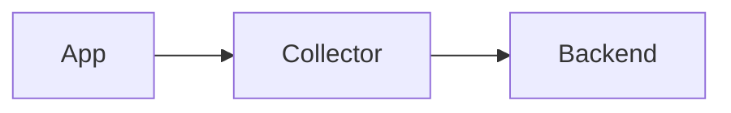

# MkDocs Conventions (<org> Corporate Docs)

Patterns for MkDocs sites at <org>. This skill captures general patterns; expand with <org>-specific theme/plugins as discovered in `<central-docs-portal>/`.

## When to use MkDocs vs other tools

| Tool | When |
|------|------|
| **MkDocs** | Static technical documentation site, multi-page, navigation tree |
| **README.md only** | Small projects, single page is enough |
| **Confluence/Notion** | Wiki-style, frequent edits, non-technical contributors |
| **Backstage TechDocs** | If platform standardizing on Backstage (uses MkDocs under the hood) |

## Standard structure

```
project-docs/
├── mkdocs.yml                  # Config
├── docs/                       # Source markdown
│   ├── index.md                # Landing page
│   ├── getting-started.md
│   ├── configuration/
│   │   ├── index.md            # Section landing
│   │   ├── env-vars.md
│   │   └── secrets.md
│   ├── architecture/
│   ├── runbooks/
│   └── assets/
│       ├── images/
│       └── stylesheets/
├── overrides/                  # Theme customizations
└── requirements.txt            # mkdocs + plugins
```

## mkdocs.yml — common <org> pattern

```yaml
site_name: <org> DevOps Documentation
site_url: https://docs.<org-domain>/devops
site_description: Internal DevOps platform docs
site_author: <org> DevOps Team

repo_url: https://gitlab.<org-domain>/devops/docs
repo_name: gitlab/devops/docs
edit_uri: edit/main/docs/

theme:
  name: material
  custom_dir: overrides
  language: en
  features:
    - navigation.tabs           # Top-level sections as tabs
    - navigation.tabs.sticky    # Tabs always visible
    - navigation.sections       # Sections in sidebar
    - navigation.expand         # Auto-expand active section
    - navigation.path           # Breadcrumbs
    - navigation.top            # Back to top button
    - search.suggest            # Search autocomplete
    - search.highlight          # Highlight matches
    - content.code.copy         # Copy button on code blocks
    - content.code.annotate     # Annotations on code lines
    - content.tabs.link         # Linked tabs (sync across page)
  palette:
    - scheme: default
      primary: indigo
      accent: indigo
      toggle:
        icon: material/brightness-7
        name: Switch to dark mode
    - scheme: slate
      primary: indigo
      accent: indigo
      toggle:
        icon: material/brightness-4
        name: Switch to light mode
  icon:
    repo: fontawesome/brands/gitlab

nav:
  - Home: index.md
  - Getting Started:
      - Overview: getting-started.md
      - Setup: setup.md
  - Architecture:
      - architecture/index.md
      - Components: architecture/components.md
  - Configuration:
      - configuration/index.md
      - Environment Variables: configuration/env-vars.md
      - Secrets: configuration/secrets.md
  - Runbooks:
      - runbooks/index.md
      - Incident Response: runbooks/incident.md

markdown_extensions:
  # Python Markdown
  - abbr
  - admonition
  - attr_list
  - def_list
  - footnotes
  - md_in_html
  - tables
  - toc:
      permalink: true
  # PyMdown Extensions
  - pymdownx.arithmatex:
      generic: true
  - pymdownx.betterem
  - pymdownx.caret
  - pymdownx.details
  - pymdownx.emoji:
      emoji_index: !!python/name:material.extensions.emoji.twemoji
      emoji_generator: !!python/name:material.extensions.emoji.to_svg
  - pymdownx.highlight:
      anchor_linenums: true
      line_spans: __span
      pygments_lang_class: true
  - pymdownx.inlinehilite
  - pymdownx.keys
  - pymdownx.mark
  - pymdownx.smartsymbols
  - pymdownx.snippets
  - pymdownx.superfences:
      custom_fences:
        - name: mermaid
          class: mermaid
          format: !!python/name:pymdownx.superfences.fence_code_format
  - pymdownx.tabbed:
      alternate_style: true
  - pymdownx.tasklist:
      custom_checkbox: true
  - pymdownx.tilde

plugins:
  - search:
      separator: '[\s\-,:!=\[\]()"`/]+|\.(?!\d)|&[lg]t;|(?!\b)(?=[A-Z][a-z])'
  - git-revision-date-localized:
      enable_creation_date: true
  - minify:
      minify_html: true

extra:
  social:
    - icon: fontawesome/brands/gitlab
      link: https://gitlab.<org-domain>
```

## requirements.txt

```txt
mkdocs==1.6.1
mkdocs-material==9.5.39
mkdocs-git-revision-date-localized-plugin==1.2.9
mkdocs-minify-plugin==0.8.0
pymdown-extensions==10.11.2
```

Pin versions for reproducible builds.

## Build via Docker

```bash
docker run --rm -v $(pwd):/docs squidfunk/mkdocs-material:latest build
docker run --rm -v $(pwd):/docs -p 8000:8000 squidfunk/mkdocs-material:latest
```

!!! warning "The build creates `site/` as root — use `--user`"
    By default the container runs as root, so the output (`site/`) is owned by `root:root`
    on the host and the user (uid 1000) cannot `rm -rf site` ("Permission denied"). Always run
    with the host UID:

    ```bash
    docker run --rm --user $(id -u):$(id -g) -e HOME=/tmp \
      -v "$(pwd):/docs" -w /docs squidfunk/mkdocs-material:latest build
    ```

    If you use `python:3.11-slim` + `pip install --user`, export the PATH:
    `export PATH=/tmp/.local/bin:$PATH` before running `mkdocs build`.
    And keep `site/` in `.gitignore` (it is a build artifact). If `site/` was already created as root, remove it
    via `docker run --rm -v "$(pwd):/docs" -w /docs alpine rm -rf site`.

## Material features cheat sheet

### Admonitions

```markdown
!!! note "Optional title"
    Content goes here.

!!! warning
    Warning content.

??? info "Collapsible"
    Hidden by default.

???+ tip "Open by default"
    Visible.
```

Types: `note`, `info`, `tip`, `warning`, `danger`, `bug`, `example`, `quote`.

### Tabs

```markdown
=== ".NET"
    ```csharp
    services.AddOtelHelper();
    ```

=== "Python"
    ```python
    setup_telemetry()
    ```
```

### Code annotations

```markdown
```yaml
key: value  # (1)!
```

1. Annotation explaining the line.
```

### Mermaid diagrams

````markdown

````

### Task lists

```markdown
- [x] Done
- [ ] Pending
```

## Navigation patterns

### Use `index.md` for section landings

```
docs/
├── architecture/
│   ├── index.md       # Section overview
│   ├── components.md
│   └── flows.md
```

```yaml
nav:
  - Architecture:
      - architecture/index.md   # ← landing
      - Components: architecture/components.md
```

### Hide sections with `omitted` (not standard, use plugin)

For maintenance only. In production, use clear navigation.

## Versioning docs (mike plugin)

For multi-version docs:

```bash
pip install mike
mike deploy --push --update-aliases 1.0 latest
mike set-default --push latest
```

## Search optimization

The default `search.separator` may not work well for technical content. Use a custom separator that handles dots, dashes, etc:

```yaml
plugins:
  - search:
      separator: '[\s\-,:!=\[\]()"`/]+|\.(?!\d)|&[lg]t;|(?!\b)(?=[A-Z][a-z])'
```

## Common pitfalls

### Pitfall: `nav` paths don't match files
mkdocs is strict — every `nav` entry must point to an existing file.

### Pitfall: relative links break
In docs, use relative links from the markdown file's location:
```markdown
[See architecture](../architecture/components.md)
```

NOT absolute paths or URL-style.

### Pitfall: moving/renaming a page breaks links in TWO directions
When moving or renaming a page, fix links in both directions:

1. **Inbound** — every file pointing TO it (`grep -rn 'oldname' docs/`).
2. **Internal** — the links INSIDE the moved file, because the relative depth changes.

Common gotcha: converting a `metrics/` directory (with `index.md`) into a `metrics.md` file
moves the page up one level — `../../library/` links become `../library/`. Always run
`mkdocs build` after moving: it lists every broken link (with a suggested fix).

### Pitfall: clickable section header vs pure grouper (`navigation.indexes`)
With the `navigation.indexes` feature enabled globally, listing an `index.md` as the first item of
a section makes the **section header clickable** (it becomes a landing page). For a header that is only
a **non-clickable grouper**, do NOT use `index.md` — name the page (e.g. `overview.md`) and list it
as a normal item:

```yaml
# Clickable header (landing page)
- Section:
    - section/index.md
    - Sub: section/sub.md

# Grouper-only header (non-clickable) — without touching the global navigation.indexes
- Section:
    - Overview: section/overview.md
    - Sub: section/sub.md
```

### Pitfall: image paths
Store images in `docs/assets/images/` or per-section `docs/<section>/images/`. Reference:
```markdown

```

### Pitfall: code block language hints
Some highlighters need specific names:
- `yaml` (not `yml`)
- `bash` or `shell` (not `sh` for highlighting)
- `dockerfile` (lowercase)

### Pitfall: build warnings ignored
```bash
mkdocs build --strict   # Treat warnings as errors
```

Always use `--strict` in CI.

## Deployment

### Static site to S3 + CloudFront

```bash
mkdocs build
aws s3 sync site/ s3://docs.<org-domain>/devops/ --delete
aws cloudfront create-invalidation --distribution-id <ID> --paths "/devops/*"
```

### GitLab Pages

```yaml
# .gitlab-ci.yml
pages:
  stage: deploy
  image: squidfunk/mkdocs-material:latest
  script:
    - mkdocs build --strict --site-dir public
  artifacts:
    paths: [public]
  only:
    - main
```

## Roadmap for this skill

- [ ] Add <org>-specific theme overrides (`overrides/`)
- [ ] Document corporate plugin set (after reading `<central-docs-portal>/mkdocs.yml`)
- [ ] Add deploy patterns for <org>-internal hosting
- [ ] Add accessibility guidelines (alt text, ARIA, color contrast)

## Reference

- MkDocs: https://www.mkdocs.org/
- Material theme: https://squidfunk.github.io/mkdocs-material/
- PyMdown extensions: https://facelessuser.github.io/pymdown-extensions/
- <org> docs (to be inventoried later): `<workspace>/<central-docs-portal>`
- Related: `markdown-docs`, `diagram-patterns`, `api-docs-patterns`
